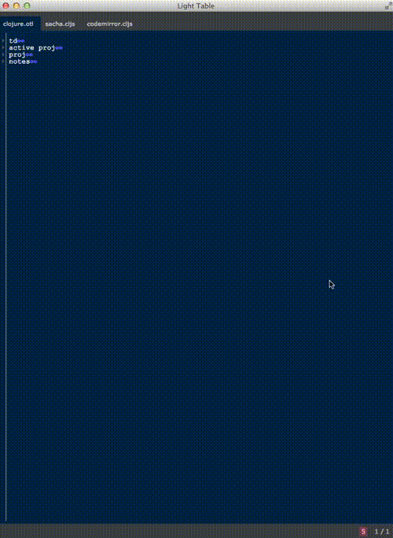

## Description

sacha is an [outliner](http://en.wikipedia.org/wiki/Outliner) for Light Table.
It comes with a full set of commands for folding/unfolding branches, moving around
in an outline and changing levels of branches. sacha means tree in [Quechua](#http://en.wikipedia.org/wiki/Quechua_languages).



## Install

Install this plugin with LT's plugin manager or clone this project to your LT
plugins directory.

## Usage

sacha is an outliner that delineates outline levels with tabs. Take for example this outline:

```
level-1
  level-2.1
  level-2.2
    level-3
another-level-1
```

This outline has two level 1 nodes, two level 2 nodes and one level 3 node. If we wanted to move
`another-level-1` to be a child of `level-1`, we would insert a tab in front of it. If we wanted to do
the reverse of this, we would unindent with `shift-tab`. When a tab key is pressed, LT's default behavior
is to insert two whitespaces. To configure a tab key to insert a tab or n white spaces using LT's
`:lt.objs.editor/tab-settings` behavior. sacha will work with any tab-settings as long as they are
consistently applied in one file. For caveats around this, see [Limitations](#limitations).

sacha files end in `.otl`. This extension is needed for sacha's keybindings and behaviors to take effect.


## Commands

sacha's commands can be found in the command bar with the prefix `sacha: `. Most commands have [keybindings](./sacha.keymap).

### Basic

* `:sacha.toggle-fold`: Toggle folding/unfolding the current branch
* `:sacha.unindent-node`: Unindents the current node by one level
* `:sacha.indent-branch`: Indents the current branch by one level
* `:sacha.unindent-branch`: Unindents the current branch by one level
* `:sacha.select-branch`: Selects the current branch. Useful in combination with delete, yank or replace.

### Fold and Unfold

* `:sacha.fold-all`: Folds all branches to closed position
* `:sacha.unfold-all`: Unfolds all branches to open position
* `:sacha.fold-level-1` to `:sacha.fold-level-9`: Commands to fold up all branches to levels 1 - 9
* `:sacha.fold-branch-one-level`: Folds current branch to be one level less than current folded level
* `:sacha.unfold-branch-one-level`: Unfolds current branch to be one level more than current unfolded level
* `:sacha.fold-all-for-branch`: Folds all children for current branch
* `:sacha.unfold-all-for-branch`: Unfolds all children for current branch

### Miscellaneous

* `:sacha.jump-to-parent`: Jump cursor to parent node
* `:sacha.jump-to-next-sibling`: Jump cursor to next sibling (even across branches)
* `:sacha.jump-to-previous-sibling`: Jump cursor to previous sibling (even across branches)
* `:sacha.move-branch-above-previous-sibling`: Move current branch to be before the previous sibling
* `:sacha.move-branch-below-next-sibling`: Move current branch to be after the next sibling
* `:sacha.zoom-branch`: Zoom/hoist current branch to another tab.
* `:sacha.raise-branch`: Raise current branch to replace parent.

Multiple LT commands can be combined into one keystroke. For example, sacha provides [a keystroke](https://github.com/cldwalker/sacha/blob/e38cfdac8692b8e8febdaceea6a67e480c0ab410/sacha.keymap#L10) to fold up to the parent using two of the above commands.

Note: if you're looking for other editing functions, remember Light Table has both [vim](https://github.com/LightTable/Vim) and [emacs](https://github.com/LightTable/Emacs) keybindings.

## Motivation

There is a [long list](http://en.wikipedia.org/wiki/Outliner#Desktop_outliners) of existing outliners. So why another?
The two major reasons are:

* Light Table has no outliner. Since I'm using LT as my daily editor, I want to make sure the most effective way I
  take notes is possible from it.
* There are very few outliners written in higher-level languages. By writing sacha in js/cljs I want to enable
  myself and others to explore new ways of improving outlining without having to dip into viml, elisp or C.

## Tips

* If you're using LT >= 0.6.6 and vim, there are built-in vim keystrokes to help with indented
  pasting. This is useful in outlining to copy or move nodes around with ease. '[p' pastes above at
  current indent level and ']p' pastes below at current indent level. This works for multiple lines.

## Limitations

* sacha should only be used on files with a consistent indent scheme. For example, changing your tabSize from 2 to 4
  midway through a file will muck with outline levels. Likewise, files that have a mix of tabs and whitespaces for
  indents will cause levels to be off. If you suspect your file has such lines, use the `:sacha.find-malformed-lines`
  command to find them.
* Moving a branch up or down and then undoing it can cause the cursor to jump just above/below the branch.
* Nodes in a tree can only be a single line, no multi-line support.
* Zoom: can't save zoomed file - must save original file. Zoomed view shows original levels. It
  would be non-trivial to keep files in sync while showing files at different levels.

## Bugs/Issues

Please report them [on github](http://github.com/cldwalker/sacha/issues).

## Contributions

[See here](http://tagaholic.me/contributing.html) for contributing guidelines.

##TODO
* Move the core of this plugin to a CodeMirror plugin so most of this available in a browser :)
* Zoom/hoist branches

## License
See LICENSE.txt
